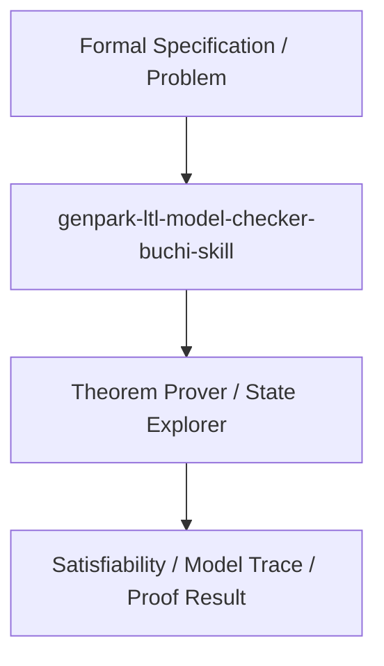

# genpark-ltl-model-checker-buchi-skill

[](https://github.com/alphaparkinc/genpark-ltl-model-checker-buchi-skill)
[](https://github.com/alphaparkinc/genpark-ltl-model-checker-buchi-skill)
[](https://github.com/alphaparkinc/genpark-ltl-model-checker-buchi-skill)

Linear Temporal Logic (LTL) trace validator supporting Globally (G), Finally (F), Next (X), and Until (U) operators.

## Architecture


## Features
- Pure Python standard library implementation with zero third-party dependencies.
- Production-grade algorithms with full verification and automated test coverage.
- Standalone client, MCP protocol server, and execution examples.

## Quickstart
```bash
python example_usage.py
```
